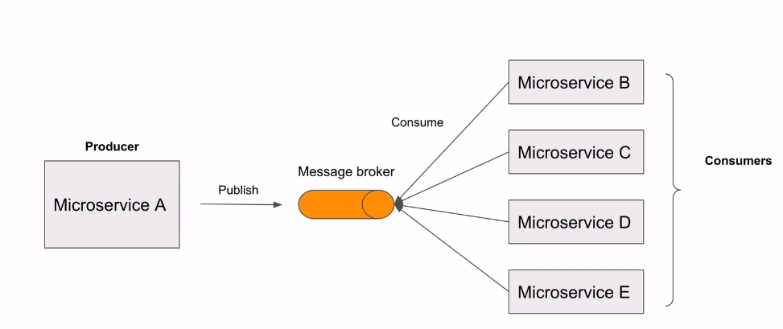
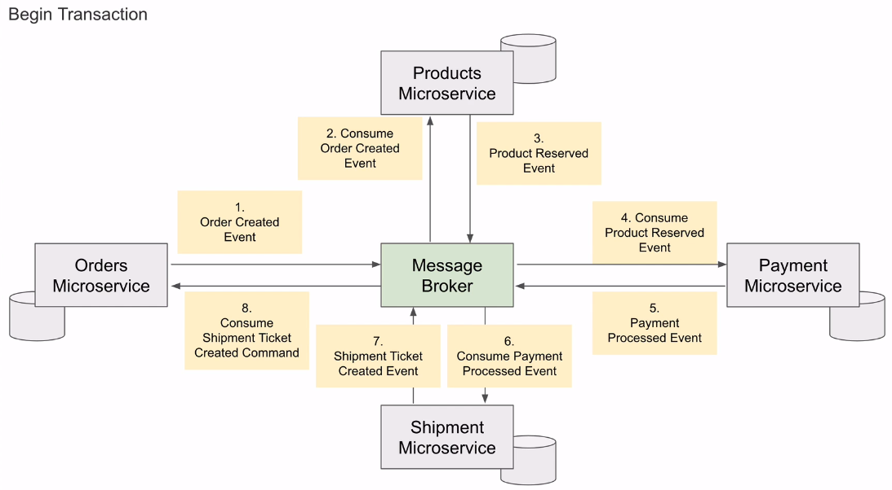
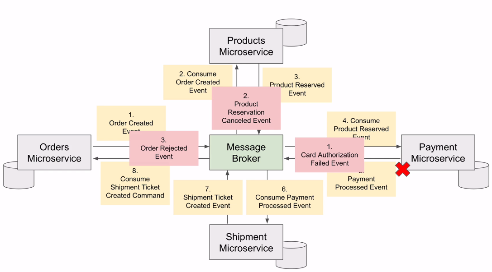
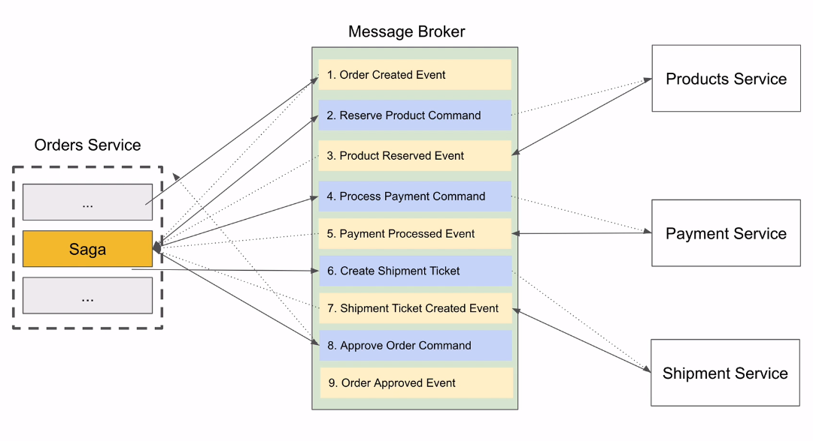
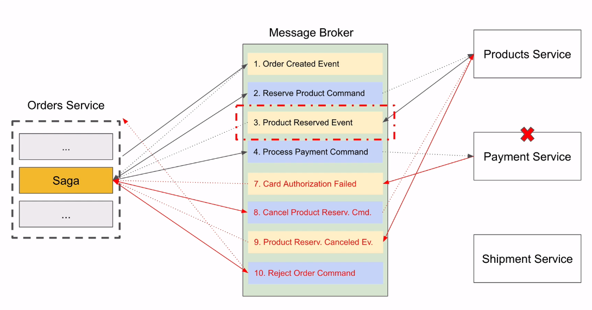
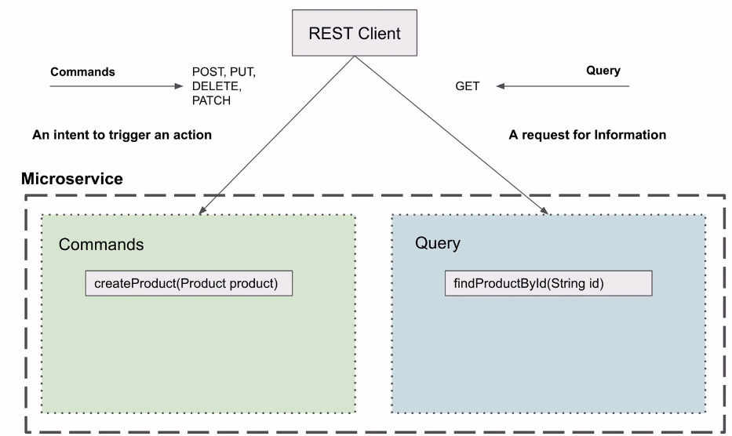
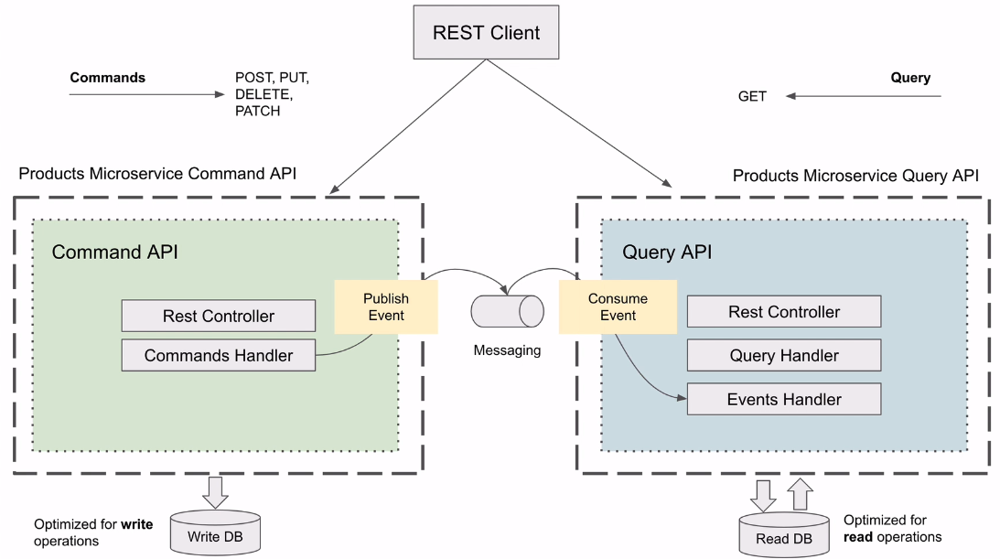

# Learning CQRS

## Microservice patterns

### Event-driven microservice


### Saga
It is a pattern to manage distribuited transactions through microservices, usinf compensation transactions when something works wrong
- Choroegraphy based: 


- Orchestration based



### CQRS
Command-Query Responsability Segregation. The idea is simple:

But this allow us to improve separating in two parts, Command and Query:

To sync two services, we are using an `Event Sourcing` pattern.

Types of messages:
- Commnand: Express the intent to change the application's state. Ex. _CreateProductCommand_. Use imperative way to describe.
- Query: Express the desire for information. Ex. _FindProductQuery_. Use words like `find` or `get` to describe.
- Event: Notification that something relevant has happend. Ex. _ProductCreatedEvent_. This kind of message comes from `Event Sourcing`.


## Some frameworks
- [Eventuate](https://eventuate.io/): has two options, `Eventuate Tram`, that use traditional persistence (JPA) and `Eventuate Local`, that use event sourcing.
- [Axon](https://axoniq.io/): Open source to event-driven microservice and CQRS.


## Axon server

Run as docker container:
```shell
docker run --name local-axon-server -p 8024:8024 -p 8124:8124 -v <localfolder>/axon/data:/data -v <localfolder>/axon/eventdata:/eventdata -v <localfolder>/axon/config:/config axoniq/axonserver
```
_note_: 8024 for HTTP and 8124 for gRPC

Some properties can be configured in a config file:
- `server.port` allows us to change the port of axon server
- `axoniq.axonserver.devmode.enabled` if set true, allows us to remove all event stored on the server

[More properties here](https://docs.axoniq.io/reference-guide/axon-server/administration/admin-configuration/configuration#configuration-properties)

---
## References
- https://naspers.udemy.com/course/spring-boot-microservices-cqrs-saga-axon-framework
- https://eventuate.io/
- https://axoniq.io/